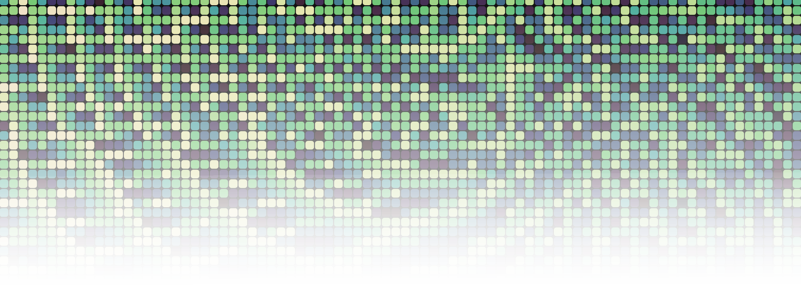

# modfield.js

A standalone JavaScript library for creative coding that combines **distance fields**, **modulators**, and **aggregators** to produce interesting, locally similar patterns. Originally developed for p5.js artworks, it now works as a pure JavaScript library.

Explore the library features on [GitHub pages](https://samjwebster.github.io/modfield/).



## Core Concepts

**modfield.js** combines three key components:

1. **Fields**: Distance-based functions that calculate values at any point in 2D space
  - `CircleField`, `LineField`, `SegmentField`, `RectField`, `OvalField`, `SineField`, `VortexField`, `RadialField`, `CrossField`, `CellularField`

2. **Modulators**: Transform distance values into interesting patterns
  - `ConstantModulator`, `FlippingConstantModulator`, `FalloffModulator`, `BinaryModulator`, `DecayModulator`, `StepModulator`, `SquareWaveModulator`, and more

3. **Aggregators**: Combine values from multiple fields
  - `aggregateWeightedAvg`, `aggregateWeightedMedian`, `aggregateWeightedRandom`, `aggregateAlternating`, `aggregateWeightedStdDev`, `aggregateSpread`, `aggregateMin`, `aggregateMax`

The library applies these techniques in easy-to-implement ways, including:

- **FieldGroups**: Combines multiple fields with modulators and an aggregator
- **FlipFieldGroups**: Blends two FieldGroups based on a single threshold field
- **Random generators**: Create randomized modulators, fields, and field groups with configurable weights and ranges

## Installation

```bash
npm install modfield
```

## Usage

### Basic Example

```javascript
import {
  generateRandomFieldGroup
  CircleField,
  ConstantModulator,
  FieldGroup,
  aggregateWeightedAvg,
} from 'modfield';

// 1. Quick random field group generation
const random_group = generateRandomFieldGroup()
const value = random_group.mod([25, 75]);
const normalized = random_group.normalize(value);
console.log(normalized) // 0-1 normalized value

// 2. Manually building a field group
// Create fields with modulators
const mod1 = new ConstantModulator(20);
const field1 = new CircleField([100, 100], mod1);
field1.weight = 1;

const mod2 = new ConstantModulator(30);
const field2 = new CircleField([200, 150], mod2);
field2.weight = 1;

// Create a field group
const group = new FieldGroup([field1, field2], aggregateWeightedAvg);

// Sample at a point
const value2 = group.mod([150, 125]);
const normalized2 = group.normalize(value2);
console.log(normalized2); // 0-1 normalized value

```

### With p5.js

```javascript
import {
  CircleField,
  DecayModulator,
  FieldGroup,
  aggregateWeightedAvg
} from 'modfield';

function setup() {
  createCanvas(800, 800);
  const mod = new DecayModulator(50);
  const field = new CircleField([400, 400], mod);
  const group = new FieldGroup([field]);
}

function draw() {
  loadPixels();
  for (let i = 0; i < pixels.length; i += 4) {
    const pixelIndex = i / 4;
    const x = pixelIndex % width;
    const y = floor(pixelIndex / width);
    
    const value = group.mod([x, y]);
    const normalized = group.normalize(value);
    const c = floor(normalized * 255);
    
    pixels[i] = c;
    pixels[i + 1] = c;
    pixels[i + 2] = c;
    pixels[i + 3] = 255;
  }
  updatePixels();
}
```

### Random Generation

The package exports helpers for generating randomized fields and modulators.

```javascript
import {
  generateRandomModulator,
  generateRandomField,
  generateRandomFields,
  generateRandomFieldGroup,
  generateRandomFlipFieldGroup
} from 'modfield';

const modulator = generateRandomModulator({
  modulatorType: 'decay',
  size: 200,
  invertChance: 0.25
});

const field = generateRandomField({
  fieldType: 'circle',
  bounds: { width: 800, height: 800 },
  modulatorOptions: {
    modulatorType: 'decay'
  }
});

const fields = generateRandomFields(8, {
  bounds: { width: 800, height: 800 },
  fieldTypes: ['circle', 'rect', 'sine'],
  modulatorTypes: ['constant', 'decay', 'squareWave']
});

const group = generateRandomFieldGroup(6, {
  fieldTypes: ['circle', 'oval', 'sine'],
  aggregatorType: 'aggregateWeightedMedian'
});

const flipGroup = generateRandomFlipFieldGroup({
  groupAFieldCount: 4,
  groupBFieldCount: 5,
  thresholdRange: [0.3, 0.7]
});
```

## Available Classes and Functions

### Fields

- **CircleField**: Distance expanding from a single point 
- **LineField**: Distance from an infinite line
- **SegmentField**: Distance from a line segment
- **RectField**: Distance from a rectangle boundary
- **OvalField**: Distance from an oval/ellipse
- **SineField**: Distance from a sine wave
- **VortexField**: Spiral pattern field
- **RadialField**: Expanding radial band patterns, like sun rays
- **CrossField**: Distance from a cross shape
- **CellularField**: Voronoi-like cellular patterns

### Modulators

- **ConstantModulator**: Saw-like repeating linear ramp
- **FlippingConstantModulator**: Triangle-like linear ramp that flips every interval
- **FalloffModulator**: Interval increases with distance
- **BinaryModulator**: On/off binary pattern
- **StepModulator**: Discrete stepped levels
- **DecayModulator**: Monotonic distance decay
- **SquareWaveModulator**: Hard on/off square wave with adjustable cycle width

### Aggregators

- **aggregateWeightedAvg**: Weighted average
- **aggregateWeightedMedian**: Weighted median
- **aggregateWeightedRandom**: Weighted random selection
- **aggregateAlternating**: Alternating pattern based on odd/even weights
- **aggregateWeightedStdDev**: Standard deviation
- **aggregateSpread**: Spread/conflict measure
- **aggregateMin**: Minimum value
- **aggregateMax**: Maximum value

### Random Generators

- **generateRandomModulator**: Creates a modulator using weighted or explicit type selection
- **generateRandomField**: Creates a field with a generated or supplied modulator
- **generateRandomFields**: Creates an array of random fields
- **generateRandomFieldGroup**: Creates a random FieldGroup with configurable fields and aggregator
- **generateRandomFlipFieldGroup**: Creates a random FieldFlipGroup with configurable branches and routing field

## Building from Source

```bash
npm install
npm run build
```

Output files:
- `dist/modfield.es.js` - ES module build
- `dist/modfield.umd.js` - UMD build

## Utility Functions

The library exports utility helpers for common workflow patterns:

- `TAU`: mathematical constant for 2*PI
- `radians(degrees)`: converts degrees to radians
- `degrees(radians)`: converts radians to degrees
- `dist(x1, y1, x2, y2)`: distance between two points
- `lerp(a, b, t)`: linear interpolation between two values
- `constrain(val, min, max)`: clamp a value between two limits
- `random()`: random numbers, ranges, or array indices

## License

ISC

## Acknowledgements

- Library created with help from [Andrew Walpole's Vite library guide](https://andrewwalpole.com/blog/use-vite-for-javascript-libraries/)
- Website generates random colors for visualizations using [Rampensau](https://github.com/meodai/rampensau)